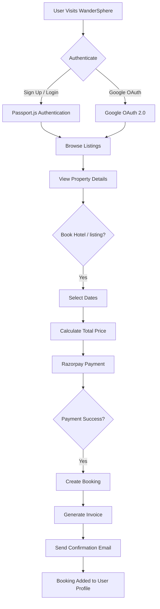
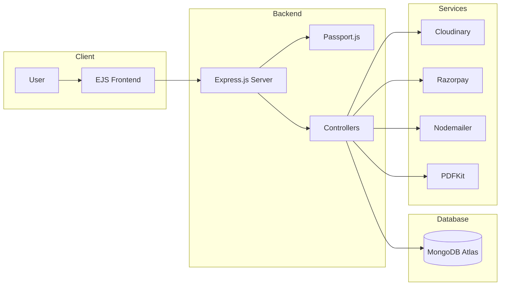

<div align="center">

# 🌍 WanderSphere

### Discover. Book. Explore.

*A full-stack travel accommodation booking platform inspired by Airbnb, built with Node.js, Express.js, EJS, and MongoDB.*

</div>

---

## ✨ Features

- 🔐 Secure Authentication with Passport.js & Google OAuth 2.0
- 🏠 Create, edit, delete, and manage property listings
- 📷 Upload and manage property images
- ⭐ Add, view, and manage reviews & ratings
- 📅 Date-based booking system with automatic price calculation
- 💳 Secure online payments using Razorpay
- 📄 Automatic PDF invoice generation
- 📧 Email booking confirmations with reference IDs
- 👤 Personalized user profile with booking history
- 🔒 Role-based authorization and protected routes

---

## 🛠️ Tech Stack

### Frontend
- HTML5
- CSS3
- Bootstrap 5
- JavaScript
- EJS

### Backend
- Node.js
- Express.js

### Database
- MongoDB Atlas
- Mongoose

### Authentication
- Passport.js
- Passport Local
- Google OAuth 2.0

### Payment Gateway
- Razorpay

### Additional Tools
- Cloudinary
- Multer
- Nodemailer
- PDFKit
- Joi
- Connect-Flash

---

# 📈 Application Workflow



---

# 🏗️ System Architecture



---

## 📁 Project Structure

```text
WanderSphere/
│
├── controllers/
├── models/
├── public/
├── routes/
├── utils/
├── views/
├── app.js
├── cloudConfig.js
├── middleware.js
├── schema.js
├── package.json
└── README.md
```

---

## 🔒 Security Features

- 🔐 Session-based authentication using Passport.js
- 🔑 Google OAuth 2.0 authentication
- 🛡️ Route protection and authorization middleware
- ✅ Input validation using Joi
- 💳 Razorpay payment signature verification (HMAC SHA256)
- 🔒 Password hashing using Passport-Local-Mongoose
- 🍪 Secure session management with MongoDB Store
---
